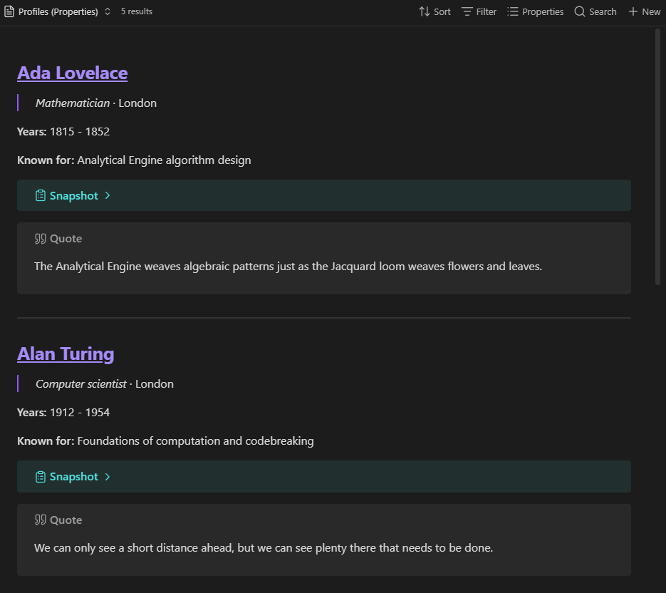
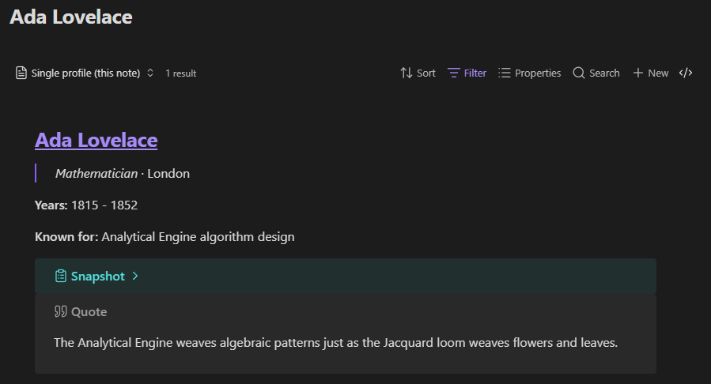

# MarkBase for Obsidian

[](https://github.com/TylerCarrol/obsidian-mark-base/releases/latest) [](https://github.com/TylerCarrol/obsidian-mark-base/blob/main/LICENSE) [](https://github.com/TylerCarrol/obsidian-mark-base/actions/workflows/lint.yml) [](https://github.com/TylerCarrol/obsidian-mark-base/actions/workflows/test.yml)
[](https://buymeacoffee.com/tylercarrol)

MarkBase combines **Markdown** and **Obsidian Bases** into one **Freeform** view. Rendering the visible
properties and formulas for every query result as one continuous Markdown
document.

## Features

- Render selected note properties, file properties, and formulas as Markdown.
- Control rendered content and its sequence with the Base properties menu.
- Follow internal links and select rendered text for copying.
- Add a multiline Markdown separator between results, or leave it empty.
- Place each note's Markdown body anywhere in the property order.
- Optionally override the property layout with a reusable Markdown template.
- Run entirely inside the vault without network requests.

## Examples




## Requirements

- Obsidian 1.13.0 or later.
- The **Bases** core plugin must be enabled.

## Use the Freeform view

1. Open a Base and change its layout to **Freeform**.
2. Use the Base properties menu to choose and reorder the properties and
   formulas to render.
3. Open **Configure view → Line separator** to set the Markdown placed between
   properties inside each result. The default is `\n`. Enter `\n\n` for a
   blank line between blocks.
4. Open **Configure view → File separator** to set the Markdown placed between
   results. Enter `\n` for a new line, such as `---\n\n---`, or clear the
   option to join results without a separator.
5. Open the Base properties menu, add `file.contents`, and drag it to where the
   note's Markdown body should render. YAML frontmatter is omitted.
6. Under **Configure view → Export**, configure the default vault folder and
   file name for future exports. **Default folder** provides suggestions from
   the folders that already exist in the vault.

Each selected value is rendered as Markdown, in property-menu order. Single
newlines in multiline formula values remain visible. `file.name` is rendered as
a link to its note. Changes to matching notes, formulas, property order, and
view options update the view automatically.

### Use a template override

For a fixed custom layout, create a Markdown file and add placeholders using
full Bases property IDs:

   ```markdown
   # [[{{file.path}}|{{note.title}}]]

   {{formula.summary}}

   {{file.contents}}
   ```

Then select it under **Configure view → Template override**. The template is
repeated for every result. Because the template explicitly controls placement,
its placeholder order takes precedence over the Base properties menu. Clear
**Template override** to return to property-order rendering. In template mode,
the line separator setting is ignored because the template provides the layout.

The view replaces these placeholder forms before rendering:

| Placeholder | Value |
| --- | --- |
| `{{note.property}}` | A property from the note's frontmatter |
| `{{file.property}}` | A built-in file property such as `file.name` or `file.path` |
| `{{file.contents}}` | The note's Markdown body, excluding YAML frontmatter |
| `{{formula.name}}` | A formula defined in the current Base |

Whitespace inside braces is optional. Missing values render as empty text.
Unsupported placeholders remain unchanged. Formula expressions must be defined
in the Base first; the template references their `formula.name`.

In template mode, place `{{file.contents}}` where the note body should appear.

`file.contents` is provided by the Freeform view, not the Bases formula engine.
Obsidian currently does not expose an API for plugins to add file properties to
formula evaluation, so it cannot be referenced from a Base formula.

Each result is rendered relative to its source note, so relative links and
embeds resolve in that note's context. Template edits are reflected
automatically. MarkBase does not add labels, italics, callouts, or other
formatting; those come only from property values or an explicitly selected
template.

## Demo vault

The ready-made [`mark-base-demo-vault`](mark-base-demo-vault/README.md) includes
a Base, two sample notes, and a Freeform template.

## Install for development

1. Install dependencies:
   ```bash
   npm install
   ```
2. Build the plugin:
   ```bash
   npm run build
   ```
3. Copy `main.js`, `manifest.json`, and `styles.css` to:
   ```text
   <Vault>/.obsidian/plugins/mark-base/
   ```
4. In Obsidian, enable **Settings → Community plugins → MarkBase**.

For watch mode during development:

```bash
npm run dev
```

## Fastest way to try it

This repository includes a ready-made demo vault in `/mark-base-demo-vault`.

- Windows/PowerShell:
  ```powershell
  .\scripts\build-to-demo-vault.ps1
  ```
- Any platform:
  1. Run `npm run build`
  2. Copy `main.js`, `manifest.json`, and `styles.css` to `mark-base-demo-vault/.obsidian/plugins/mark-base/`
  3. Open `mark-base-demo-vault` in Obsidian

See [`mark-base-demo-vault/README.md`](mark-base-demo-vault/README.md) for a
guided walkthrough.
