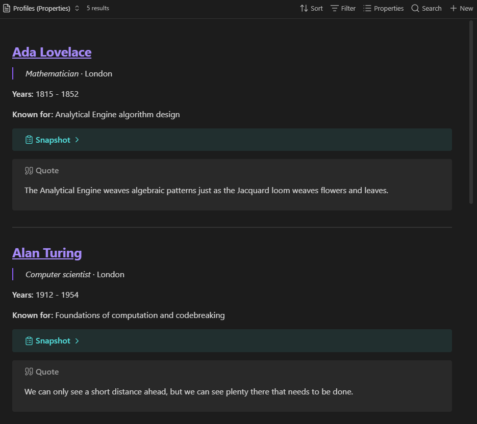
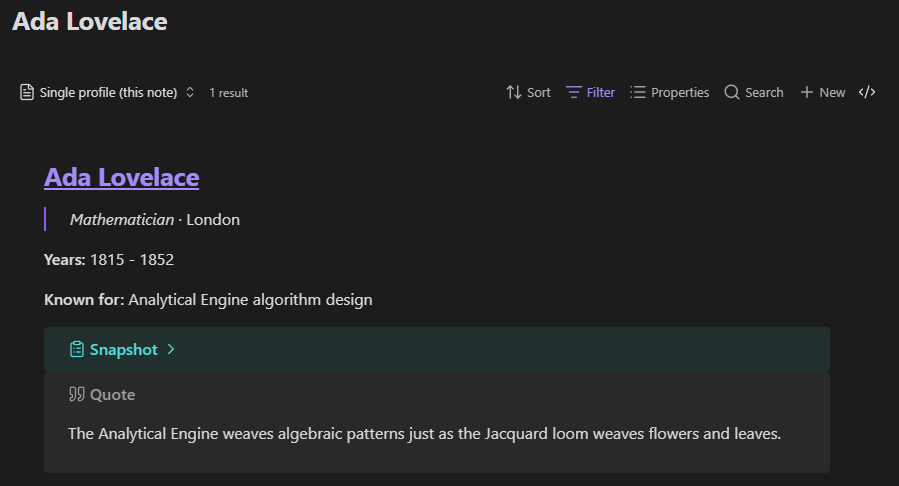

# MarkBase for Obsidian

[](https://github.com/TylerCarrol/obsidian-mark-base/releases/latest)
[](https://github.com/TylerCarrol/obsidian-mark-base/blob/main/LICENSE)
[](https://github.com/TylerCarrol/obsidian-mark-base/actions/workflows/lint.yml)
[](https://github.com/TylerCarrol/obsidian-mark-base/actions/workflows/test.yml)
[](https://github.com/TylerCarrol/obsidian-mark-base?category=code)
[](https://buymeacoffee.com/tylercarrol)

MarkBase combines **Markdown** and **Obsidian Bases** into one **Freeform** view. Rendering the visible
properties and formulas for every query result as one continuous Markdown
document.

## Features

- Render selected note properties, file properties, and formulas as Markdown.
- Control rendered content and its sequence with the Base properties menu.
- Follow internal links and select rendered text for copying.
- Add a multiline Markdown separator between results, or leave it empty.
- Place each note's Markdown body anywhere in the property order.
- Show body excerpts through formulas: line ranges, tagged lines or blocks,
   and regex matches.
- Edit note bodies with cursor-sensitive Markdown formatting and wikilink
   suggestions.
- Optionally override the property layout with a reusable Markdown template.
- Run entirely inside the vault without network requests.

## Examples




## Requirements

- Obsidian 1.13.0 or later.
- The **Bases** core plugin must be enabled.

## Use the Freeform view

1. Open a Base and change its layout to **Freeform**.
2. Use the Base properties menu to choose and reorder the properties and
   formulas to render.
3. Open **Configure view → Line separator** to set the Markdown placed between
   properties inside each result. The default is `\n`. Enter `\n\n` for a
   blank line between blocks.
4. Open **Configure view → File separator** to set the Markdown placed between
   results. Enter `\n` for a new line, such as `---\n\n---`, or clear the
   option to join results without a separator.
5. Enable **Configure view → Add file contents (one-shot button)** to add
   `file.contents` to the property order. The option turns itself off after
   it runs. Then drag `file.contents` in the Base properties menu to where the
   note's Markdown body should render. YAML frontmatter is omitted.
  - Please note that due to technical limitations it is not currently possible to add from the "properties" menu.
6. To edit note bodies in place, enable **Configure view → Enable file contents
   editing**, then select a rendered note body. Markdown markers appear for
   the formatting at the caret. Type `[[` to search for notes and insert a
   wikilink. Changes save when focus leaves the editor.
7. Under **Configure view → Export**, configure the default vault folder and
   file name for future exports. **Default folder** provides suggestions from
   the folders that already exist in the vault.
8. Under **Configure view → Folding**, enable or disable controls for folding
   Markdown heading sections and complete notes.
   Select the gutter chevron beside a heading to fold its section.
   Select the outer gutter chevron beside a note to fold the complete note.

Fold chevrons appear on hover or keyboard focus. Folded chevrons stay visible.
On touch devices, all fold chevrons stay visible.
A folded note shows its filename so you can find it and expand it.
Heading folding also works in editable note previews.

Each selected value is rendered as Markdown, in property-menu order. Single
newlines in multiline formula values remain visible. `file.name` is rendered as
a link to its note. Changes to matching notes, formulas, property order, and
view options update the view automatically.

Grouped Bases show group headers when **Show export button** is off.
When **Show export button** is on, group headers appear only if
**Group by creates separate output files** is on.
This setting still controls whether exports create one file or separate files.

### Use a template override

For a fixed custom layout, create a Markdown file and add placeholders using
full Bases property IDs:

   ```markdown
   # [[{{file.path}}|{{note.title}}]]

   {{formula.summary}}

   {{file.contents}}
   ```

Then select it under **Configure view → Template override**. The template is
repeated for every result. Because the template explicitly controls placement,
its placeholder order takes precedence over the Base properties menu. Clear
**Template override** to return to property-order rendering. In template mode,
the line separator setting is ignored because the template provides the layout.

The view replaces these placeholder forms before rendering:

| Placeholder | Value |
| --- | --- |
| `{{note.property}}` | A property from the note's frontmatter |
| `{{file.property}}` | A built-in file property such as `file.name` or `file.path` |
| `{{file.contents}}` | The note's Markdown body, excluding YAML frontmatter |
| `{{formula.name}}` | A formula defined in the current Base |

Whitespace inside braces is optional. Missing values render as empty text.
Unsupported placeholders remain unchanged. Formula expressions must be defined
in the Base first; the template references their `formula.name`.

In template mode, place `{{file.contents}}` where the note body should appear.

`file.contents` is provided by the Freeform view, not the Bases formula engine.
Obsidian currently does not expose an API for plugins to add file properties to
formula evaluation, so it cannot be referenced from a Base formula.

### Show partial file contents with formulas

Create a Base formula that returns a MarkBase instruction list. Then select
that formula in the Base properties menu.

| Selection | Formula expression |
| --- | --- |
| Body lines 10 through 20 | `["markbase.contents", "lines", 10, 20]` |
| Body line 10 through the end | `["markbase.contents", "lines", 10]` |
| Lines with `#todo` or its nested tags | `["markbase.contents", "tag", "#todo", "lines"]` |
| Complete blocks with those tags | `["markbase.contents", "tag", "#todo", "blocks"]` |
| Lines with unchecked tasks | `["markbase.contents", "regex", "^[-*] \\[ \\]", "lines"]` |
| Blocks that contain "decision", case-insensitively | `["markbase.contents", "regex", "decision", "blocks", "i"]` |
| Tag argument from a note property | `["markbase.contents", "tag", note.excerptTag, "blocks"]` |

MarkBase resolves the instruction into Markdown in Freeform previews and
exports. Templates also support these formulas through placeholders such as
`{{formula.Excerpt}}`.

**Line ranges:** Line 1 starts immediately after YAML frontmatter. Blank lines
count, and both endpoints are included. A final newline does not add an extra
empty line. A range beyond the body returns the available lines or empty text.
Invalid, non-positive, fractional, or reversed ranges produce an error.

**Tags:** The leading `#` is optional. Matches ignore case and include nested
tags. For example, `#todo` matches `#todo/work`, but not `#todoish`.
Only inline tags that Obsidian recognizes select content. Frontmatter tags
and tag-like text inside code fences do not select content.

**Output modes:** Tag and regex selectors require `lines` or `blocks`.
The `blocks` mode uses Obsidian's root-level Markdown blocks, including whole
paragraphs, lists, callouts, tables, and code fences. A heading selects only
its heading block, not the entire heading section.

**Regex:** Each line or block is a separate match target. Block patterns can
match across lines. The optional flags are `i`, `m`, `s`, and `u`.
Patterns are strings without surrounding `/` delimiters. Escape backslashes
for the Bases string, as the task example shows. Regex selectors can match
literal text inside code fences.

Source order and indentation remain unchanged within each excerpt. Separated
lines use one newline. Separated blocks use a blank line. No matches produce
empty text. Obsidian metadata must be available for tag and block selection.
If metadata is not current, the view shows an error and updates after indexing.

Regex selection uses a local worker with a 1,000 ms timeout per instruction.
Invalid patterns, timeouts, and unavailable workers produce explicit errors.
An export stops before it writes files if an instruction fails.

**Limits:** Excerpts are read-only, even if full-body editing is enabled.
These formulas return instructions, not native text values. Other Bases
layouts show the instruction list. Bases cannot filter, sort, group, or
calculate on the resolved excerpt. Native expressions can supply selector
arguments, but operations such as `.join()` do not operate on excerpt text.
Each formula must return one complete instruction list. Cross-note selection
and selector chaining are not supported.

Each result is rendered relative to its source note, so relative links and
embeds resolve in that note's context. Template edits are reflected
automatically. MarkBase does not add labels, italics, callouts, or other
formatting; those come only from property values or an explicitly selected
template.

## Demo vault

The ready-made [`mark-base-demo-vault`](mark-base-demo-vault/README.md) includes
a Base, two sample notes, and a Freeform template.

## Install for development

1. Install dependencies:
   ```bash
   npm install
   ```
2. Build the plugin:
   ```bash
   npm run build
   ```
3. Copy `main.js`, `manifest.json`, and `styles.css` to:
   ```text
   <Vault>/.obsidian/plugins/mark-base/
   ```
4. In Obsidian, enable **Settings → Community plugins → MarkBase**.

For watch mode during development:

```bash
npm run dev
```

## Fastest way to try it

This repository includes a ready-made demo vault in `/mark-base-demo-vault`.

- Windows/PowerShell:
  ```powershell
  .\scripts\build-to-demo-vault.ps1
  ```
- Any platform:
  1. Run `npm run build`
  2. Copy `main.js`, `manifest.json`, and `styles.css` to `mark-base-demo-vault/.obsidian/plugins/mark-base/`
  3. Open `mark-base-demo-vault` in Obsidian

See [`mark-base-demo-vault/README.md`](mark-base-demo-vault/README.md) for a
guided walkthrough.
